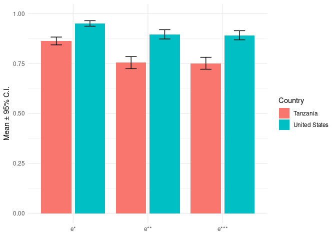
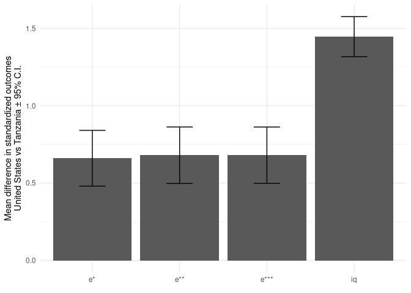

The Development Gap in Economic Rationality of Future Elites
================
Erik Ø. Sørensen
21 juni, 2023

- [Reading data](#reading-data)
- [Summaries of background data](#summaries-of-background-data)
- [Graphs of behavioral outcomes](#graphs-of-behavioral-outcomes)
  - [Means of the main outcomes](#means-of-the-main-outcomes)
  - [Survival function plot](#survival-function-plot)
- [Summary statistics on socio
  demographics](#summary-statistics-on-socio-demographics)
  - [Tests for table](#tests-for-table)
- [Risk aversion](#risk-aversion)
- [Development gap in econ
  rationality](#development-gap-in-econ-rationality)
- [More descriptives about the
  samples](#more-descriptives-about-the-samples)
  - [Where are they from?](#where-are-they-from)
- [Appendix: Treatment effect of stakes (in
  Tanzania)](#appendix-treatment-effect-of-stakes-in-tanzania)

# Reading data

``` r
tar_load(df)
```

# Summaries of background data

``` r
df %>% group_by(country) %>%
  summarize(one_parent_college = mean(one_parent_college),
            female = mean(sex==2),
            age = mean(age, na.rm=TRUE)) |>
  kable(digits=c(0,3,3,1))
```

<table>
<thead>
<tr>
<th style="text-align:left;">
country
</th>
<th style="text-align:right;">
one_parent_college
</th>
<th style="text-align:right;">
female
</th>
<th style="text-align:right;">
age
</th>
</tr>
</thead>
<tbody>
<tr>
<td style="text-align:left;">
Tanzania
</td>
<td style="text-align:right;">
NA
</td>
<td style="text-align:right;">
NA
</td>
<td style="text-align:right;">
23.3
</td>
</tr>
<tr>
<td style="text-align:left;">
United States
</td>
<td style="text-align:right;">
0.825
</td>
<td style="text-align:right;">
0.706
</td>
<td style="text-align:right;">
20.6
</td>
</tr>
</tbody>
</table>

# Graphs of behavioral outcomes

## Means of the main outcomes

Overall means for a striking first figure of the rationalizability
scores. First, calculate the means and standard errors for both the
original and the standardized scores.

``` r
tar_load(fig_dta)
```

What are the levels in each country and the level differences:

``` r
fig_dta |> dplyr::select(country, outcome_nm, mean) |> 
  pivot_wider(id_cols=outcome_nm, names_from = country, values_from = mean) |>
  mutate(difference = `United States` - Tanzania) |>
  gt::gt() |>
  gt::fmt_number(columns=c(Tanzania, `United States`, difference), decimals=3)
```

<div id="iuwtuyikqu" style="padding-left:0px;padding-right:0px;padding-top:10px;padding-bottom:10px;overflow-x:auto;overflow-y:auto;width:auto;height:auto;">
<style>html {
  font-family: -apple-system, BlinkMacSystemFont, 'Segoe UI', Roboto, Oxygen, Ubuntu, Cantarell, 'Helvetica Neue', 'Fira Sans', 'Droid Sans', Arial, sans-serif;
}
&#10;#iuwtuyikqu .gt_table {
  display: table;
  border-collapse: collapse;
  margin-left: auto;
  margin-right: auto;
  color: #333333;
  font-size: 16px;
  font-weight: normal;
  font-style: normal;
  background-color: #FFFFFF;
  width: auto;
  border-top-style: solid;
  border-top-width: 2px;
  border-top-color: #A8A8A8;
  border-right-style: none;
  border-right-width: 2px;
  border-right-color: #D3D3D3;
  border-bottom-style: solid;
  border-bottom-width: 2px;
  border-bottom-color: #A8A8A8;
  border-left-style: none;
  border-left-width: 2px;
  border-left-color: #D3D3D3;
}
&#10;#iuwtuyikqu .gt_heading {
  background-color: #FFFFFF;
  text-align: center;
  border-bottom-color: #FFFFFF;
  border-left-style: none;
  border-left-width: 1px;
  border-left-color: #D3D3D3;
  border-right-style: none;
  border-right-width: 1px;
  border-right-color: #D3D3D3;
}
&#10;#iuwtuyikqu .gt_caption {
  padding-top: 4px;
  padding-bottom: 4px;
}
&#10;#iuwtuyikqu .gt_title {
  color: #333333;
  font-size: 125%;
  font-weight: initial;
  padding-top: 4px;
  padding-bottom: 4px;
  padding-left: 5px;
  padding-right: 5px;
  border-bottom-color: #FFFFFF;
  border-bottom-width: 0;
}
&#10;#iuwtuyikqu .gt_subtitle {
  color: #333333;
  font-size: 85%;
  font-weight: initial;
  padding-top: 0;
  padding-bottom: 6px;
  padding-left: 5px;
  padding-right: 5px;
  border-top-color: #FFFFFF;
  border-top-width: 0;
}
&#10;#iuwtuyikqu .gt_bottom_border {
  border-bottom-style: solid;
  border-bottom-width: 2px;
  border-bottom-color: #D3D3D3;
}
&#10;#iuwtuyikqu .gt_col_headings {
  border-top-style: solid;
  border-top-width: 2px;
  border-top-color: #D3D3D3;
  border-bottom-style: solid;
  border-bottom-width: 2px;
  border-bottom-color: #D3D3D3;
  border-left-style: none;
  border-left-width: 1px;
  border-left-color: #D3D3D3;
  border-right-style: none;
  border-right-width: 1px;
  border-right-color: #D3D3D3;
}
&#10;#iuwtuyikqu .gt_col_heading {
  color: #333333;
  background-color: #FFFFFF;
  font-size: 100%;
  font-weight: normal;
  text-transform: inherit;
  border-left-style: none;
  border-left-width: 1px;
  border-left-color: #D3D3D3;
  border-right-style: none;
  border-right-width: 1px;
  border-right-color: #D3D3D3;
  vertical-align: bottom;
  padding-top: 5px;
  padding-bottom: 6px;
  padding-left: 5px;
  padding-right: 5px;
  overflow-x: hidden;
}
&#10;#iuwtuyikqu .gt_column_spanner_outer {
  color: #333333;
  background-color: #FFFFFF;
  font-size: 100%;
  font-weight: normal;
  text-transform: inherit;
  padding-top: 0;
  padding-bottom: 0;
  padding-left: 4px;
  padding-right: 4px;
}
&#10;#iuwtuyikqu .gt_column_spanner_outer:first-child {
  padding-left: 0;
}
&#10;#iuwtuyikqu .gt_column_spanner_outer:last-child {
  padding-right: 0;
}
&#10;#iuwtuyikqu .gt_column_spanner {
  border-bottom-style: solid;
  border-bottom-width: 2px;
  border-bottom-color: #D3D3D3;
  vertical-align: bottom;
  padding-top: 5px;
  padding-bottom: 5px;
  overflow-x: hidden;
  display: inline-block;
  width: 100%;
}
&#10;#iuwtuyikqu .gt_group_heading {
  padding-top: 8px;
  padding-bottom: 8px;
  padding-left: 5px;
  padding-right: 5px;
  color: #333333;
  background-color: #FFFFFF;
  font-size: 100%;
  font-weight: initial;
  text-transform: inherit;
  border-top-style: solid;
  border-top-width: 2px;
  border-top-color: #D3D3D3;
  border-bottom-style: solid;
  border-bottom-width: 2px;
  border-bottom-color: #D3D3D3;
  border-left-style: none;
  border-left-width: 1px;
  border-left-color: #D3D3D3;
  border-right-style: none;
  border-right-width: 1px;
  border-right-color: #D3D3D3;
  vertical-align: middle;
  text-align: left;
}
&#10;#iuwtuyikqu .gt_empty_group_heading {
  padding: 0.5px;
  color: #333333;
  background-color: #FFFFFF;
  font-size: 100%;
  font-weight: initial;
  border-top-style: solid;
  border-top-width: 2px;
  border-top-color: #D3D3D3;
  border-bottom-style: solid;
  border-bottom-width: 2px;
  border-bottom-color: #D3D3D3;
  vertical-align: middle;
}
&#10;#iuwtuyikqu .gt_from_md > :first-child {
  margin-top: 0;
}
&#10;#iuwtuyikqu .gt_from_md > :last-child {
  margin-bottom: 0;
}
&#10;#iuwtuyikqu .gt_row {
  padding-top: 8px;
  padding-bottom: 8px;
  padding-left: 5px;
  padding-right: 5px;
  margin: 10px;
  border-top-style: solid;
  border-top-width: 1px;
  border-top-color: #D3D3D3;
  border-left-style: none;
  border-left-width: 1px;
  border-left-color: #D3D3D3;
  border-right-style: none;
  border-right-width: 1px;
  border-right-color: #D3D3D3;
  vertical-align: middle;
  overflow-x: hidden;
}
&#10;#iuwtuyikqu .gt_stub {
  color: #333333;
  background-color: #FFFFFF;
  font-size: 100%;
  font-weight: initial;
  text-transform: inherit;
  border-right-style: solid;
  border-right-width: 2px;
  border-right-color: #D3D3D3;
  padding-left: 5px;
  padding-right: 5px;
}
&#10;#iuwtuyikqu .gt_stub_row_group {
  color: #333333;
  background-color: #FFFFFF;
  font-size: 100%;
  font-weight: initial;
  text-transform: inherit;
  border-right-style: solid;
  border-right-width: 2px;
  border-right-color: #D3D3D3;
  padding-left: 5px;
  padding-right: 5px;
  vertical-align: top;
}
&#10;#iuwtuyikqu .gt_row_group_first td {
  border-top-width: 2px;
}
&#10;#iuwtuyikqu .gt_summary_row {
  color: #333333;
  background-color: #FFFFFF;
  text-transform: inherit;
  padding-top: 8px;
  padding-bottom: 8px;
  padding-left: 5px;
  padding-right: 5px;
}
&#10;#iuwtuyikqu .gt_first_summary_row {
  border-top-style: solid;
  border-top-color: #D3D3D3;
}
&#10;#iuwtuyikqu .gt_first_summary_row.thick {
  border-top-width: 2px;
}
&#10;#iuwtuyikqu .gt_last_summary_row {
  padding-top: 8px;
  padding-bottom: 8px;
  padding-left: 5px;
  padding-right: 5px;
  border-bottom-style: solid;
  border-bottom-width: 2px;
  border-bottom-color: #D3D3D3;
}
&#10;#iuwtuyikqu .gt_grand_summary_row {
  color: #333333;
  background-color: #FFFFFF;
  text-transform: inherit;
  padding-top: 8px;
  padding-bottom: 8px;
  padding-left: 5px;
  padding-right: 5px;
}
&#10;#iuwtuyikqu .gt_first_grand_summary_row {
  padding-top: 8px;
  padding-bottom: 8px;
  padding-left: 5px;
  padding-right: 5px;
  border-top-style: double;
  border-top-width: 6px;
  border-top-color: #D3D3D3;
}
&#10;#iuwtuyikqu .gt_striped {
  background-color: rgba(128, 128, 128, 0.05);
}
&#10;#iuwtuyikqu .gt_table_body {
  border-top-style: solid;
  border-top-width: 2px;
  border-top-color: #D3D3D3;
  border-bottom-style: solid;
  border-bottom-width: 2px;
  border-bottom-color: #D3D3D3;
}
&#10;#iuwtuyikqu .gt_footnotes {
  color: #333333;
  background-color: #FFFFFF;
  border-bottom-style: none;
  border-bottom-width: 2px;
  border-bottom-color: #D3D3D3;
  border-left-style: none;
  border-left-width: 2px;
  border-left-color: #D3D3D3;
  border-right-style: none;
  border-right-width: 2px;
  border-right-color: #D3D3D3;
}
&#10;#iuwtuyikqu .gt_footnote {
  margin: 0px;
  font-size: 90%;
  padding-left: 4px;
  padding-right: 4px;
  padding-left: 5px;
  padding-right: 5px;
}
&#10;#iuwtuyikqu .gt_sourcenotes {
  color: #333333;
  background-color: #FFFFFF;
  border-bottom-style: none;
  border-bottom-width: 2px;
  border-bottom-color: #D3D3D3;
  border-left-style: none;
  border-left-width: 2px;
  border-left-color: #D3D3D3;
  border-right-style: none;
  border-right-width: 2px;
  border-right-color: #D3D3D3;
}
&#10;#iuwtuyikqu .gt_sourcenote {
  font-size: 90%;
  padding-top: 4px;
  padding-bottom: 4px;
  padding-left: 5px;
  padding-right: 5px;
}
&#10;#iuwtuyikqu .gt_left {
  text-align: left;
}
&#10;#iuwtuyikqu .gt_center {
  text-align: center;
}
&#10;#iuwtuyikqu .gt_right {
  text-align: right;
  font-variant-numeric: tabular-nums;
}
&#10;#iuwtuyikqu .gt_font_normal {
  font-weight: normal;
}
&#10;#iuwtuyikqu .gt_font_bold {
  font-weight: bold;
}
&#10;#iuwtuyikqu .gt_font_italic {
  font-style: italic;
}
&#10;#iuwtuyikqu .gt_super {
  font-size: 65%;
}
&#10;#iuwtuyikqu .gt_footnote_marks {
  font-style: italic;
  font-weight: normal;
  font-size: 75%;
  vertical-align: 0.4em;
}
&#10;#iuwtuyikqu .gt_asterisk {
  font-size: 100%;
  vertical-align: 0;
}
&#10;#iuwtuyikqu .gt_indent_1 {
  text-indent: 5px;
}
&#10;#iuwtuyikqu .gt_indent_2 {
  text-indent: 10px;
}
&#10;#iuwtuyikqu .gt_indent_3 {
  text-indent: 15px;
}
&#10;#iuwtuyikqu .gt_indent_4 {
  text-indent: 20px;
}
&#10;#iuwtuyikqu .gt_indent_5 {
  text-indent: 25px;
}
</style>
<table class="gt_table">
  &#10;  <thead class="gt_col_headings">
    <tr>
      <th class="gt_col_heading gt_columns_bottom_border gt_center" rowspan="1" colspan="1" scope="col" id="outcome_nm">outcome_nm</th>
      <th class="gt_col_heading gt_columns_bottom_border gt_right" rowspan="1" colspan="1" scope="col" id="Tanzania">Tanzania</th>
      <th class="gt_col_heading gt_columns_bottom_border gt_right" rowspan="1" colspan="1" scope="col" id="United States">United States</th>
      <th class="gt_col_heading gt_columns_bottom_border gt_right" rowspan="1" colspan="1" scope="col" id="difference">difference</th>
    </tr>
  </thead>
  <tbody class="gt_table_body">
    <tr><td headers="outcome_nm" class="gt_row gt_center">e*</td>
<td headers="Tanzania" class="gt_row gt_right">0.863</td>
<td headers="United States" class="gt_row gt_right">0.951</td>
<td headers="difference" class="gt_row gt_right">0.088</td></tr>
    <tr><td headers="outcome_nm" class="gt_row gt_center">e**</td>
<td headers="Tanzania" class="gt_row gt_right">0.754</td>
<td headers="United States" class="gt_row gt_right">0.896</td>
<td headers="difference" class="gt_row gt_right">0.142</td></tr>
    <tr><td headers="outcome_nm" class="gt_row gt_center">e***</td>
<td headers="Tanzania" class="gt_row gt_right">0.751</td>
<td headers="United States" class="gt_row gt_right">0.892</td>
<td headers="difference" class="gt_row gt_right">0.140</td></tr>
    <tr><td headers="outcome_nm" class="gt_row gt_center">iq</td>
<td headers="Tanzania" class="gt_row gt_right">0.489</td>
<td headers="United States" class="gt_row gt_right">0.856</td>
<td headers="difference" class="gt_row gt_right">0.366</td></tr>
  </tbody>
  &#10;  
</table>
</div>

Now, the first plot with the rationalizability scores:

``` r
fig_dta %>% filter(outcome_nm!="iq") %>%
  ggplot(aes(x=outcome_nm, 
             y=mean, 
             ymin = mean - 1.96 * se_mean, 
             ymax = mean + 1.96 * se_mean, 
             fill=country)) + 
  geom_bar(orientation="x", stat="identity", position=position_dodge2()) +
  geom_errorbar(position=position_dodge(0.9), width=0.3) +
  labs(y="Mean \u00B1 95% C.I.", x= element_blank(), fill = "Country") +
  theme_minimal() + 
  ylim(0, 1) 
```

<!-- -->

``` r
ggsave(here("graphs", "mean_differences.pdf"), width=16, height=10, units="cm")
```

Similar graph, but with standardized outcomes and including the IQ
scores. We decided to change this graph into differences between
countries: I make it differences between US and Tanzania.

``` r
fig_dtaw <- fig_dta |> 
  pivot_wider(id_cols = outcome_nm, names_from = country, values_from = c(zmean, se_zmean)) |>
  mutate( zdiff = `zmean_United States` - zmean_Tanzania,
          zdiff_se =  sqrt((`se_zmean_United States`)^2 + se_zmean_Tanzania^2 ))
```

``` r
fig_dtaw %>%
  ggplot(aes(x=outcome_nm, 
             y=zdiff, 
             ymin = zdiff - 1.96 * zdiff_se, 
             ymax = zdiff + 1.96 * zdiff_se)) + 
  geom_col() +
  geom_errorbar(width=0.3) +
  labs(y="Mean difference in standardized outcomes\nUnited States vs Tanzania \u00B1 95% C.I.", x= element_blank()) +
  theme_minimal() 
```

<!-- -->

``` r
ggsave(here("graphs", "zmean_differences.pdf"), width=16, height=10, units="cm")
```

In the final figure, each of the four outcomes have been standardized to
an overall average of zero and unit variance before calculating the
averages by country.

## Survival function plot

``` r
tar_load(cdf_data)
```

    ## ✖ Identified no targets to load.

``` r
tar_load(survival_gg)
survival_gg 
```

<!-- -->

``` r
ggsave(here::here("graphs","survival_graph.pdf"), 
       width=16, height=10, units="cm")
```

# Summary statistics on socio demographics

``` r
dfb_selected <- df %>% dplyr::select(c("ID", "workincome", "two_parents_HS", 
                                 "one_parent_college"))
df %>% dplyr::select(c("ID", "country", "age", "female", "BF_E", "BF_A", "BF_C", 
  "BF_N", "BF_O", "iq")) %>%
  left_join(dfb_selected, by="ID") %>%
  dplyr::select(-"ID") %>%
  group_by(country) %>%
  summarize_all(list(mean= ~ mean(., na.rm=TRUE), se= ~se(.)))  %>%
  gather(key="key", value="value", age_mean:one_parent_college_se) %>%
  spread(key="country", value="value") %>% knitr::kable(digits=3)
```

<table>
<thead>
<tr>
<th style="text-align:left;">
key
</th>
<th style="text-align:right;">
Tanzania
</th>
<th style="text-align:right;">
United States
</th>
</tr>
</thead>
<tbody>
<tr>
<td style="text-align:left;">
age_mean
</td>
<td style="text-align:right;">
23.259
</td>
<td style="text-align:right;">
20.611
</td>
</tr>
<tr>
<td style="text-align:left;">
age_se
</td>
<td style="text-align:right;">
0.137
</td>
<td style="text-align:right;">
0.382
</td>
</tr>
<tr>
<td style="text-align:left;">
BF_A_mean
</td>
<td style="text-align:right;">
0.771
</td>
<td style="text-align:right;">
0.596
</td>
</tr>
<tr>
<td style="text-align:left;">
BF_A_se
</td>
<td style="text-align:right;">
0.019
</td>
<td style="text-align:right;">
0.043
</td>
</tr>
<tr>
<td style="text-align:left;">
BF_C_mean
</td>
<td style="text-align:right;">
0.836
</td>
<td style="text-align:right;">
0.404
</td>
</tr>
<tr>
<td style="text-align:left;">
BF_C_se
</td>
<td style="text-align:right;">
0.021
</td>
<td style="text-align:right;">
0.049
</td>
</tr>
<tr>
<td style="text-align:left;">
BF_E_mean
</td>
<td style="text-align:right;">
0.288
</td>
<td style="text-align:right;">
0.153
</td>
</tr>
<tr>
<td style="text-align:left;">
BF_E_se
</td>
<td style="text-align:right;">
0.022
</td>
<td style="text-align:right;">
0.057
</td>
</tr>
<tr>
<td style="text-align:left;">
BF_N_mean
</td>
<td style="text-align:right;">
-0.326
</td>
<td style="text-align:right;">
-0.124
</td>
</tr>
<tr>
<td style="text-align:left;">
BF_N_se
</td>
<td style="text-align:right;">
0.024
</td>
<td style="text-align:right;">
0.054
</td>
</tr>
<tr>
<td style="text-align:left;">
BF_O_mean
</td>
<td style="text-align:right;">
0.398
</td>
<td style="text-align:right;">
0.428
</td>
</tr>
<tr>
<td style="text-align:left;">
BF_O_se
</td>
<td style="text-align:right;">
0.021
</td>
<td style="text-align:right;">
0.044
</td>
</tr>
<tr>
<td style="text-align:left;">
female_mean
</td>
<td style="text-align:right;">
0.336
</td>
<td style="text-align:right;">
0.706
</td>
</tr>
<tr>
<td style="text-align:left;">
female_se
</td>
<td style="text-align:right;">
0.032
</td>
<td style="text-align:right;">
0.041
</td>
</tr>
<tr>
<td style="text-align:left;">
iq_mean
</td>
<td style="text-align:right;">
0.489
</td>
<td style="text-align:right;">
0.856
</td>
</tr>
<tr>
<td style="text-align:left;">
iq_se
</td>
<td style="text-align:right;">
0.015
</td>
<td style="text-align:right;">
0.008
</td>
</tr>
<tr>
<td style="text-align:left;">
one_parent_college_mean
</td>
<td style="text-align:right;">
0.307
</td>
<td style="text-align:right;">
0.825
</td>
</tr>
<tr>
<td style="text-align:left;">
one_parent_college_se
</td>
<td style="text-align:right;">
0.032
</td>
<td style="text-align:right;">
0.034
</td>
</tr>
<tr>
<td style="text-align:left;">
two_parents_HS_mean
</td>
<td style="text-align:right;">
NaN
</td>
<td style="text-align:right;">
NaN
</td>
</tr>
<tr>
<td style="text-align:left;">
two_parents_HS_se
</td>
<td style="text-align:right;">
NA
</td>
<td style="text-align:right;">
NA
</td>
</tr>
<tr>
<td style="text-align:left;">
workincome_mean
</td>
<td style="text-align:right;">
0.065
</td>
<td style="text-align:right;">
0.317
</td>
</tr>
<tr>
<td style="text-align:left;">
workincome_se
</td>
<td style="text-align:right;">
0.017
</td>
<td style="text-align:right;">
0.042
</td>
</tr>
</tbody>
</table>

## Tests for table

``` r
df %>% t.test(iq ~ country, data=.)
```

    ## 
    ##  Welch Two Sample t-test
    ## 
    ## data:  iq by country
    ## t = -21.913, df = 307, p-value < 2.2e-16
    ## alternative hypothesis: true difference in means between group Tanzania and group United States is not equal to 0
    ## 95 percent confidence interval:
    ##  -0.3993318 -0.3335233
    ## sample estimates:
    ##      mean in group Tanzania mean in group United States 
    ##                   0.4894943                   0.8559219

``` r
df %>% t.test(BF_A ~ country, data=.)
```

    ## 
    ##  Welch Two Sample t-test
    ## 
    ## data:  BF_A by country
    ## t = 3.6791, df = 175.97, p-value = 0.0003109
    ## alternative hypothesis: true difference in means between group Tanzania and group United States is not equal to 0
    ## 95 percent confidence interval:
    ##  0.08096733 0.26834923
    ## sample estimates:
    ##      mean in group Tanzania mean in group United States 
    ##                   0.7711393                   0.5964810

``` r
df %>% t.test(BF_C ~ country, data=.)
```

    ## 
    ##  Welch Two Sample t-test
    ## 
    ## data:  BF_C by country
    ## t = 8.1596, df = 171.8, p-value = 6.852e-14
    ## alternative hypothesis: true difference in means between group Tanzania and group United States is not equal to 0
    ## 95 percent confidence interval:
    ##  0.3278477 0.5370815
    ## sample estimates:
    ##      mean in group Tanzania mean in group United States 
    ##                   0.8361968                   0.4037322

``` r
df %>% t.test(BF_E ~ country, data=.)
```

    ## 
    ##  Welch Two Sample t-test
    ## 
    ## data:  BF_E by country
    ## t = 2.2042, df = 163.18, p-value = 0.02891
    ## alternative hypothesis: true difference in means between group Tanzania and group United States is not equal to 0
    ## 95 percent confidence interval:
    ##  0.01401852 0.25516060
    ## sample estimates:
    ##      mean in group Tanzania mean in group United States 
    ##                   0.2876916                   0.1531020

``` r
df %>% t.test(BF_N ~ country, data=.)
```

    ## 
    ##  Welch Two Sample t-test
    ## 
    ## data:  BF_N by country
    ## t = -3.4025, df = 174.49, p-value = 0.0008282
    ## alternative hypothesis: true difference in means between group Tanzania and group United States is not equal to 0
    ## 95 percent confidence interval:
    ##  -0.31936261 -0.08487723
    ## sample estimates:
    ##      mean in group Tanzania mean in group United States 
    ##                  -0.3261702                  -0.1240503

``` r
df %>% t.test(BF_O ~ country, data=.)
```

    ## 
    ##  Welch Two Sample t-test
    ## 
    ## data:  BF_O by country
    ## t = -0.62255, df = 179.92, p-value = 0.5344
    ## alternative hypothesis: true difference in means between group Tanzania and group United States is not equal to 0
    ## 95 percent confidence interval:
    ##  -0.12643667  0.06578957
    ## sample estimates:
    ##      mean in group Tanzania mean in group United States 
    ##                   0.3976757                   0.4279992

# Risk aversion

For Tanzania, we are interested in whether high and low stakes
individuals exhibited different risk aversion. We operationalize risk
aversion by the average fraction of tokens in the cheaper security.

Now, what are the average risk aversion in the three group?

``` r
df |> group_by(country_high) |> summarize(mean = mean(mean_cheapest_asset),
                                          std.dev = sd(mean_cheapest_asset),
                                          se = std.dev/sqrt(n())) |>
  knitr::kable(digits=3)
```

<table>
<thead>
<tr>
<th style="text-align:left;">
country_high
</th>
<th style="text-align:right;">
mean
</th>
<th style="text-align:right;">
std.dev
</th>
<th style="text-align:right;">
se
</th>
</tr>
</thead>
<tbody>
<tr>
<td style="text-align:left;">
Tanzania - high
</td>
<td style="text-align:right;">
0.592
</td>
<td style="text-align:right;">
0.080
</td>
<td style="text-align:right;">
0.008
</td>
</tr>
<tr>
<td style="text-align:left;">
Tanzania - low
</td>
<td style="text-align:right;">
0.617
</td>
<td style="text-align:right;">
0.098
</td>
<td style="text-align:right;">
0.010
</td>
</tr>
<tr>
<td style="text-align:left;">
United States
</td>
<td style="text-align:right;">
0.643
</td>
<td style="text-align:right;">
0.100
</td>
<td style="text-align:right;">
0.009
</td>
</tr>
</tbody>
</table>

Testing (t-test) for equality between the treatments in Tanzania?

``` r
df %>% filter(Tanzania==1) %>%
  t.test(mean_cheapest_asset ~ Treatment, data=.)
```

    ## 
    ##  Welch Two Sample t-test
    ## 
    ## data:  mean_cheapest_asset by Treatment
    ## t = 2.072, df = 202.72, p-value = 0.03953
    ## alternative hypothesis: true difference in means between group 1 and group 2 is not equal to 0
    ## 95 percent confidence interval:
    ##  0.001224164 0.049389444
    ## sample estimates:
    ## mean in group 1 mean in group 2 
    ##       0.6169172       0.5916104

Correlations between risk aversion and outcomes:

``` r
df %>% group_by(country) %>% 
  summarize(c_e1 = cor(mean_cheapest_asset, CCEI_PQR),
            c_e2 = cor(mean_cheapest_asset, FOSD_PQR),
            c_e3 = cor(mean_cheapest_asset, EU_PQR),
            c_IQ = cor(mean_cheapest_asset, iq)) %>%
  knitr::kable(digits=3)
```

<table>
<thead>
<tr>
<th style="text-align:left;">
country
</th>
<th style="text-align:right;">
c_e1
</th>
<th style="text-align:right;">
c_e2
</th>
<th style="text-align:right;">
c_e3
</th>
<th style="text-align:right;">
c_IQ
</th>
</tr>
</thead>
<tbody>
<tr>
<td style="text-align:left;">
Tanzania
</td>
<td style="text-align:right;">
-0.025
</td>
<td style="text-align:right;">
-0.026
</td>
<td style="text-align:right;">
-0.022
</td>
<td style="text-align:right;">
-0.029
</td>
</tr>
<tr>
<td style="text-align:left;">
United States
</td>
<td style="text-align:right;">
0.066
</td>
<td style="text-align:right;">
0.117
</td>
<td style="text-align:right;">
0.124
</td>
<td style="text-align:right;">
0.210
</td>
</tr>
</tbody>
</table>

# Development gap in econ rationality

``` r
GARP1 <- lm(CCEI_PQR ~ Tanzania + High + mean_cheapest_asset + age + female + one_parent_college, data=df)
GARP2 <- lm(CCEI_PQR ~ Tanzania + High + mean_cheapest_asset + age + female + one_parent_college + BF_A + BF_C + BF_E + BF_N + BF_O , data=df)
GARP3 <- lm(CCEI_PQR ~ Tanzania + High + mean_cheapest_asset + age + female + one_parent_college + BF_A + BF_C + BF_E + BF_N + BF_O + iq, data=df)

FGARP1 <- lm(FOSD_PQR ~ Tanzania + High + mean_cheapest_asset + age + female + one_parent_college, data=df)
FGARP2 <- lm(FOSD_PQR ~ Tanzania + High + mean_cheapest_asset + age + female + one_parent_college + BF_A + BF_C + BF_E + BF_N + BF_O , data=df)
FGARP3 <- lm(FOSD_PQR ~ Tanzania + High + mean_cheapest_asset + age + female + one_parent_college + BF_A + BF_C + BF_E + BF_N + BF_O + iq, data=df)

EUT1 <- lm(EU_PQR ~ Tanzania + High + mean_cheapest_asset + age + female + one_parent_college , data=df)
EUT2 <- lm(EU_PQR ~ Tanzania + High + mean_cheapest_asset + age + female + one_parent_college + BF_A + BF_C + BF_E + BF_N + BF_O ,  data=df)
EUT3 <- lm(EU_PQR ~ Tanzania + High + mean_cheapest_asset + age + female + one_parent_college + BF_A + BF_C + BF_E + BF_N + BF_O + iq, data=df)

IQ1 <- lm(iq ~ Tanzania + High + mean_cheapest_asset + age + female + one_parent_college, data=df)
IQ2 <- lm(iq ~ Tanzania + High + mean_cheapest_asset + age + female + one_parent_college + 
              BF_A + BF_C + BF_E + BF_N + BF_O, data=df)
```

Based on these regressions, I want to add the p-value of a test that
there is no difference between the US and the Tanzanian high group:

``` r
ftests <- c("US equal to Tanzania high (p-val)", 
            format(summary(glht(GARP1, linfct = c("Tanzania + High = 0")))$test$pvalues[1],digits=3),
            format(summary(glht(FGARP1, linfct = c("Tanzania + High = 0")))$test$pvalues[1],digits=3),
            format(summary(glht(EUT1, linfct = c("Tanzania + High = 0")))$test$pvalues[1],digits=3),
            format(summary(glht(GARP2, linfct = c("Tanzania + High = 0")))$test$pvalues[1],digits=3),
            format(summary(glht(FGARP2, linfct = c("Tanzania + High = 0")))$test$pvalues[1],digits=3),
            format(summary(glht(EUT2, linfct = c("Tanzania + High = 0")))$test$pvalues[1],digits=3),
            format(summary(glht(GARP3, linfct = c("Tanzania + High = 0")))$test$pvalues[1],digits=3),
            format(summary(glht(FGARP3, linfct = c("Tanzania + High = 0")))$test$pvalues[1],digits=3),
            format(summary(glht(EUT3, linfct = c("Tanzania + High = 0")))$test$pvalues[1],digits=3),
            format(summary(glht(IQ1, linfct = c("Tanzania + High = 0")))$test$pvalues[1],digits=3),
            format(summary(glht(IQ2, linfct = c("Tanzania + High = 0")))$test$pvalues[1],digits=3)
)
```

``` r
m_names <- c('Tanzania' = 'Tanzania',
             'High' = 'High stakes (Tanzania)',
             'mean_cheapest_asset' = 'Risk aversion',
             'age' = 'Age',
             'female' = 'Female',
             'one_parent_college' = 'Parents have college education',
             'iq' = 'IQ')

modelsummary::modelsummary(list("(1)"=GARP1, "(2)"=FGARP1, "(3)"=EUT1, 
                                "(4)"=GARP2, "(5)"=FGARP2, "(6)"=EUT2,
                                "(7)"=GARP3, "(8)"=FGARP3, "(9)"=EUT3,
                                "(10)"=IQ1, "(11)"=IQ2),
                           statistic = "std.error", coef_map = m_names,
                           stars = TRUE,
                           gof_omit = 'R2 Adj.|AIC|BIC|Log.Lik.|F',
                           output = 'latex',
                           add_rows = as.data.frame(t(ftests))) %>%
  add_header_above(c(" " = 1, "Baseline" = 3, "Baseline + Big-5" = 3,  "Baseline + Big-5 and IQ" = 3, "Cognitive ability" = 2)) %>%
  cat(file= here::here("tables/development_gap.tex"))
```

    ## Warning: To compile a LaTeX document with this table, the following commands must be placed in the document preamble:
    ## 
    ## \usepackage{booktabs}
    ## \usepackage{siunitx}
    ## \newcolumntype{d}{S[
    ##     input-open-uncertainty=,
    ##     input-close-uncertainty=,
    ##     parse-numbers = false,
    ##     table-align-text-pre=false,
    ##     table-align-text-post=false
    ##  ]}
    ## 
    ## To disable `siunitx` and prevent `modelsummary` from wrapping numeric entries in `\num{}`, call:
    ## 
    ## options("modelsummary_format_numeric_latex" = "plain")
    ##  This warning appears once per session.

Also outputting to html record:

``` r
modelsummary::modelsummary(list("(1)"=GARP1, "(2)"=FGARP1, "(3)"=EUT1, 
                                "(4)"=GARP2, "(5)"=FGARP2, "(6)"=EUT2,
                                "(7)"=GARP3, "(8)"=FGARP3, "(9)"=EUT3,
                                "(10)"=IQ1, "(11)"=IQ2),
                           statistic = "std.error", coef_map = m_names,
                           stars = TRUE,
                           gof_omit = 'R2 Adj.|AIC|BIC|Log.Lik.|F',
                           output = 'kableExtra',
                           add_rows = as.data.frame(t(ftests))) %>%
  add_header_above(c(" " = 1, "Baseline" = 3, "Baseline + Big-5" = 3,  "Baseline + Big-5 and IQ" = 3, "Cognitive ability" = 2)) 
```

<table style="NAborder-bottom: 0; width: auto !important; margin-left: auto; margin-right: auto;" class="table">
<thead>
<tr>
<th style="empty-cells: hide;border-bottom:hidden;" colspan="1">
</th>
<th style="border-bottom:hidden;padding-bottom:0; padding-left:3px;padding-right:3px;text-align: center; " colspan="3">

<div style="border-bottom: 1px solid #ddd; padding-bottom: 5px; ">

Baseline

</div>

</th>
<th style="border-bottom:hidden;padding-bottom:0; padding-left:3px;padding-right:3px;text-align: center; " colspan="3">

<div style="border-bottom: 1px solid #ddd; padding-bottom: 5px; ">

Baseline + Big-5

</div>

</th>
<th style="border-bottom:hidden;padding-bottom:0; padding-left:3px;padding-right:3px;text-align: center; " colspan="3">

<div style="border-bottom: 1px solid #ddd; padding-bottom: 5px; ">

Baseline + Big-5 and IQ

</div>

</th>
<th style="border-bottom:hidden;padding-bottom:0; padding-left:3px;padding-right:3px;text-align: center; " colspan="2">

<div style="border-bottom: 1px solid #ddd; padding-bottom: 5px; ">

Cognitive ability

</div>

</th>
</tr>
<tr>
<th style="text-align:left;">
</th>
<th style="text-align:center;">
 (1)
</th>
<th style="text-align:center;">
  (2)
</th>
<th style="text-align:center;">
  (3)
</th>
<th style="text-align:center;">
  (4)
</th>
<th style="text-align:center;">
  (5)
</th>
<th style="text-align:center;">
  (6)
</th>
<th style="text-align:center;">
  (7)
</th>
<th style="text-align:center;">
  (8)
</th>
<th style="text-align:center;">
  (9)
</th>
<th style="text-align:center;">
  (10)
</th>
<th style="text-align:center;">
  (11)
</th>
</tr>
</thead>
<tbody>
<tr>
<td style="text-align:left;">
Tanzania
</td>
<td style="text-align:center;">
−0.079\*\*\*
</td>
<td style="text-align:center;">
−0.143\*\*\*
</td>
<td style="text-align:center;">
−0.140\*\*\*
</td>
<td style="text-align:center;">
−0.091\*\*\*
</td>
<td style="text-align:center;">
−0.161\*\*\*
</td>
<td style="text-align:center;">
−0.158\*\*\*
</td>
<td style="text-align:center;">
−0.070\*\*
</td>
<td style="text-align:center;">
−0.106\*\*
</td>
<td style="text-align:center;">
−0.105\*\*
</td>
<td style="text-align:center;">
−0.316\*\*\*
</td>
<td style="text-align:center;">
−0.315\*\*\*
</td>
</tr>
<tr>
<td style="text-align:left;">
</td>
<td style="text-align:center;">
(0.020)
</td>
<td style="text-align:center;">
(0.031)
</td>
<td style="text-align:center;">
(0.030)
</td>
<td style="text-align:center;">
(0.021)
</td>
<td style="text-align:center;">
(0.033)
</td>
<td style="text-align:center;">
(0.032)
</td>
<td style="text-align:center;">
(0.024)
</td>
<td style="text-align:center;">
(0.037)
</td>
<td style="text-align:center;">
(0.037)
</td>
<td style="text-align:center;">
(0.028)
</td>
<td style="text-align:center;">
(0.030)
</td>
</tr>
<tr>
<td style="text-align:left;">
High stakes (Tanzania)
</td>
<td style="text-align:center;">
0.017
</td>
<td style="text-align:center;">
0.054\*
</td>
<td style="text-align:center;">
0.052+
</td>
<td style="text-align:center;">
0.016
</td>
<td style="text-align:center;">
0.051+
</td>
<td style="text-align:center;">
0.049+
</td>
<td style="text-align:center;">
0.018
</td>
<td style="text-align:center;">
0.056\*
</td>
<td style="text-align:center;">
0.053\*
</td>
<td style="text-align:center;">
−0.024
</td>
<td style="text-align:center;">
−0.026
</td>
</tr>
<tr>
<td style="text-align:left;">
</td>
<td style="text-align:center;">
(0.017)
</td>
<td style="text-align:center;">
(0.027)
</td>
<td style="text-align:center;">
(0.027)
</td>
<td style="text-align:center;">
(0.017)
</td>
<td style="text-align:center;">
(0.027)
</td>
<td style="text-align:center;">
(0.027)
</td>
<td style="text-align:center;">
(0.017)
</td>
<td style="text-align:center;">
(0.027)
</td>
<td style="text-align:center;">
(0.027)
</td>
<td style="text-align:center;">
(0.025)
</td>
<td style="text-align:center;">
(0.025)
</td>
</tr>
<tr>
<td style="text-align:left;">
Risk aversion
</td>
<td style="text-align:center;">
−0.001
</td>
<td style="text-align:center;">
0.038
</td>
<td style="text-align:center;">
0.047
</td>
<td style="text-align:center;">
−0.005
</td>
<td style="text-align:center;">
0.034
</td>
<td style="text-align:center;">
0.045
</td>
<td style="text-align:center;">
−0.007
</td>
<td style="text-align:center;">
0.028
</td>
<td style="text-align:center;">
0.039
</td>
<td style="text-align:center;">
0.051
</td>
<td style="text-align:center;">
0.033
</td>
</tr>
<tr>
<td style="text-align:left;">
</td>
<td style="text-align:center;">
(0.074)
</td>
<td style="text-align:center;">
(0.115)
</td>
<td style="text-align:center;">
(0.114)
</td>
<td style="text-align:center;">
(0.075)
</td>
<td style="text-align:center;">
(0.117)
</td>
<td style="text-align:center;">
(0.115)
</td>
<td style="text-align:center;">
(0.075)
</td>
<td style="text-align:center;">
(0.115)
</td>
<td style="text-align:center;">
(0.114)
</td>
<td style="text-align:center;">
(0.106)
</td>
<td style="text-align:center;">
(0.108)
</td>
</tr>
<tr>
<td style="text-align:left;">
Age
</td>
<td style="text-align:center;">
−0.002
</td>
<td style="text-align:center;">
−0.003
</td>
<td style="text-align:center;">
−0.003
</td>
<td style="text-align:center;">
−0.002
</td>
<td style="text-align:center;">
−0.003
</td>
<td style="text-align:center;">
−0.003
</td>
<td style="text-align:center;">
−0.002
</td>
<td style="text-align:center;">
−0.003
</td>
<td style="text-align:center;">
−0.003
</td>
<td style="text-align:center;">
−0.002
</td>
<td style="text-align:center;">
−0.002
</td>
</tr>
<tr>
<td style="text-align:left;">
</td>
<td style="text-align:center;">
(0.002)
</td>
<td style="text-align:center;">
(0.004)
</td>
<td style="text-align:center;">
(0.003)
</td>
<td style="text-align:center;">
(0.002)
</td>
<td style="text-align:center;">
(0.004)
</td>
<td style="text-align:center;">
(0.004)
</td>
<td style="text-align:center;">
(0.002)
</td>
<td style="text-align:center;">
(0.004)
</td>
<td style="text-align:center;">
(0.003)
</td>
<td style="text-align:center;">
(0.003)
</td>
<td style="text-align:center;">
(0.003)
</td>
</tr>
<tr>
<td style="text-align:left;">
Female
</td>
<td style="text-align:center;">
0.009
</td>
<td style="text-align:center;">
0.017
</td>
<td style="text-align:center;">
0.018
</td>
<td style="text-align:center;">
0.007
</td>
<td style="text-align:center;">
0.013
</td>
<td style="text-align:center;">
0.015
</td>
<td style="text-align:center;">
0.005
</td>
<td style="text-align:center;">
0.006
</td>
<td style="text-align:center;">
0.008
</td>
<td style="text-align:center;">
0.039+
</td>
<td style="text-align:center;">
0.039+
</td>
</tr>
<tr>
<td style="text-align:left;">
</td>
<td style="text-align:center;">
(0.015)
</td>
<td style="text-align:center;">
(0.023)
</td>
<td style="text-align:center;">
(0.023)
</td>
<td style="text-align:center;">
(0.015)
</td>
<td style="text-align:center;">
(0.023)
</td>
<td style="text-align:center;">
(0.023)
</td>
<td style="text-align:center;">
(0.015)
</td>
<td style="text-align:center;">
(0.023)
</td>
<td style="text-align:center;">
(0.023)
</td>
<td style="text-align:center;">
(0.021)
</td>
<td style="text-align:center;">
(0.022)
</td>
</tr>
<tr>
<td style="text-align:left;">
Parents have college education
</td>
<td style="text-align:center;">
0.015
</td>
<td style="text-align:center;">
0.016
</td>
<td style="text-align:center;">
0.015
</td>
<td style="text-align:center;">
0.018
</td>
<td style="text-align:center;">
0.022
</td>
<td style="text-align:center;">
0.021
</td>
<td style="text-align:center;">
0.016
</td>
<td style="text-align:center;">
0.017
</td>
<td style="text-align:center;">
0.016
</td>
<td style="text-align:center;">
0.027
</td>
<td style="text-align:center;">
0.027
</td>
</tr>
<tr>
<td style="text-align:left;">
</td>
<td style="text-align:center;">
(0.016)
</td>
<td style="text-align:center;">
(0.025)
</td>
<td style="text-align:center;">
(0.025)
</td>
<td style="text-align:center;">
(0.016)
</td>
<td style="text-align:center;">
(0.025)
</td>
<td style="text-align:center;">
(0.025)
</td>
<td style="text-align:center;">
(0.016)
</td>
<td style="text-align:center;">
(0.025)
</td>
<td style="text-align:center;">
(0.025)
</td>
<td style="text-align:center;">
(0.023)
</td>
<td style="text-align:center;">
(0.023)
</td>
</tr>
<tr>
<td style="text-align:left;">
IQ
</td>
<td style="text-align:center;">
</td>
<td style="text-align:center;">
</td>
<td style="text-align:center;">
</td>
<td style="text-align:center;">
</td>
<td style="text-align:center;">
</td>
<td style="text-align:center;">
</td>
<td style="text-align:center;">
0.067+
</td>
<td style="text-align:center;">
0.176\*\*
</td>
<td style="text-align:center;">
0.168\*\*
</td>
<td style="text-align:center;">
</td>
<td style="text-align:center;">
</td>
</tr>
<tr>
<td style="text-align:left;box-shadow: 0px 1px">
</td>
<td style="text-align:center;box-shadow: 0px 1px">
</td>
<td style="text-align:center;box-shadow: 0px 1px">
</td>
<td style="text-align:center;box-shadow: 0px 1px">
</td>
<td style="text-align:center;box-shadow: 0px 1px">
</td>
<td style="text-align:center;box-shadow: 0px 1px">
</td>
<td style="text-align:center;box-shadow: 0px 1px">
</td>
<td style="text-align:center;box-shadow: 0px 1px">
(0.038)
</td>
<td style="text-align:center;box-shadow: 0px 1px">
(0.059)
</td>
<td style="text-align:center;box-shadow: 0px 1px">
(0.058)
</td>
<td style="text-align:center;box-shadow: 0px 1px">
</td>
<td style="text-align:center;box-shadow: 0px 1px">
</td>
</tr>
<tr>
<td style="text-align:left;">
Num.Obs.
</td>
<td style="text-align:center;">
338
</td>
<td style="text-align:center;">
338
</td>
<td style="text-align:center;">
338
</td>
<td style="text-align:center;">
338
</td>
<td style="text-align:center;">
338
</td>
<td style="text-align:center;">
338
</td>
<td style="text-align:center;">
338
</td>
<td style="text-align:center;">
338
</td>
<td style="text-align:center;">
338
</td>
<td style="text-align:center;">
338
</td>
<td style="text-align:center;">
338
</td>
</tr>
<tr>
<td style="text-align:left;">
R2
</td>
<td style="text-align:center;">
0.111
</td>
<td style="text-align:center;">
0.125
</td>
<td style="text-align:center;">
0.124
</td>
<td style="text-align:center;">
0.125
</td>
<td style="text-align:center;">
0.136
</td>
<td style="text-align:center;">
0.136
</td>
<td style="text-align:center;">
0.133
</td>
<td style="text-align:center;">
0.159
</td>
<td style="text-align:center;">
0.158
</td>
<td style="text-align:center;">
0.501
</td>
<td style="text-align:center;">
0.503
</td>
</tr>
<tr>
<td style="text-align:left;">
RMSE
</td>
<td style="text-align:center;">
0.12
</td>
<td style="text-align:center;">
0.19
</td>
<td style="text-align:center;">
0.19
</td>
<td style="text-align:center;">
0.12
</td>
<td style="text-align:center;">
0.19
</td>
<td style="text-align:center;">
0.19
</td>
<td style="text-align:center;">
0.12
</td>
<td style="text-align:center;">
0.19
</td>
<td style="text-align:center;">
0.19
</td>
<td style="text-align:center;">
0.18
</td>
<td style="text-align:center;">
0.18
</td>
</tr>
<tr>
<td style="text-align:left;">
US equal to Tanzania high (p-val)
</td>
<td style="text-align:center;">
0.00232
</td>
<td style="text-align:center;">
0.00444
</td>
<td style="text-align:center;">
0.00419
</td>
<td style="text-align:center;">
0.000437
</td>
<td style="text-align:center;">
0.000914
</td>
<td style="text-align:center;">
0.000873
</td>
<td style="text-align:center;">
0.0352
</td>
<td style="text-align:center;">
0.188
</td>
<td style="text-align:center;">
0.169
</td>
<td style="text-align:center;">
0
</td>
<td style="text-align:center;">
0
</td>
</tr>
</tbody>
<tfoot>
<tr>
<td style="padding: 0; " colspan="100%">
<sup></sup> + p \< 0.1, \* p \< 0.05, \*\* p \< 0.01, \*\*\* p \< 0.001
</td>
</tr>
</tfoot>
</table>

Also want to add row with standard deviation of outcomes.

``` r
df %>% dplyr::select(CCEI_PQR, FOSD_PQR, EU_PQR, iq) |>
  summarise_all(sd) %>%
  knitr::kable(digits=3)
```

<table>
<thead>
<tr>
<th style="text-align:right;">
CCEI_PQR
</th>
<th style="text-align:right;">
FOSD_PQR
</th>
<th style="text-align:right;">
EU_PQR
</th>
<th style="text-align:right;">
iq
</th>
</tr>
</thead>
<tbody>
<tr>
<td style="text-align:right;">
0.133
</td>
<td style="text-align:right;">
0.209
</td>
<td style="text-align:right;">
0.206
</td>
<td style="text-align:right;">
0.253
</td>
</tr>
</tbody>
</table>

# More descriptives about the samples

For the Tanzania sample, we have a separate survey.

``` r
tar_load(tanzaniasurvey)
tz_df <- tanzaniasurvey
```

## Where are they from?

There are 32 **regions** in Tanzania (three of them on Zanzibar). I have
manually classified self-reported birthplace to region.

``` r
tz_df %>% group_by(birth_region) %>%
  summarize( n = n()) %>%
  arrange(-n) %>% 
  mutate( proportion = n/sum(n), 
          ranking = row_number()) %>%
  knitr::kable(digits=3)
```

<table>
<thead>
<tr>
<th style="text-align:left;">
birth_region
</th>
<th style="text-align:right;">
n
</th>
<th style="text-align:right;">
proportion
</th>
<th style="text-align:right;">
ranking
</th>
</tr>
</thead>
<tbody>
<tr>
<td style="text-align:left;">
Kagera
</td>
<td style="text-align:right;">
37
</td>
<td style="text-align:right;">
0.172
</td>
<td style="text-align:right;">
1
</td>
</tr>
<tr>
<td style="text-align:left;">
Dar es Salaam
</td>
<td style="text-align:right;">
36
</td>
<td style="text-align:right;">
0.167
</td>
<td style="text-align:right;">
2
</td>
</tr>
<tr>
<td style="text-align:left;">
Kilimanjaro
</td>
<td style="text-align:right;">
29
</td>
<td style="text-align:right;">
0.135
</td>
<td style="text-align:right;">
3
</td>
</tr>
<tr>
<td style="text-align:left;">
Mbeya
</td>
<td style="text-align:right;">
13
</td>
<td style="text-align:right;">
0.060
</td>
<td style="text-align:right;">
4
</td>
</tr>
<tr>
<td style="text-align:left;">
Mara
</td>
<td style="text-align:right;">
10
</td>
<td style="text-align:right;">
0.047
</td>
<td style="text-align:right;">
5
</td>
</tr>
<tr>
<td style="text-align:left;">
Shinyanga
</td>
<td style="text-align:right;">
9
</td>
<td style="text-align:right;">
0.042
</td>
<td style="text-align:right;">
6
</td>
</tr>
<tr>
<td style="text-align:left;">
Arusha
</td>
<td style="text-align:right;">
8
</td>
<td style="text-align:right;">
0.037
</td>
<td style="text-align:right;">
7
</td>
</tr>
<tr>
<td style="text-align:left;">
Kigoma
</td>
<td style="text-align:right;">
8
</td>
<td style="text-align:right;">
0.037
</td>
<td style="text-align:right;">
8
</td>
</tr>
<tr>
<td style="text-align:left;">
Mwanza
</td>
<td style="text-align:right;">
8
</td>
<td style="text-align:right;">
0.037
</td>
<td style="text-align:right;">
9
</td>
</tr>
<tr>
<td style="text-align:left;">
Tanga
</td>
<td style="text-align:right;">
8
</td>
<td style="text-align:right;">
0.037
</td>
<td style="text-align:right;">
10
</td>
</tr>
<tr>
<td style="text-align:left;">
Dodoma
</td>
<td style="text-align:right;">
6
</td>
<td style="text-align:right;">
0.028
</td>
<td style="text-align:right;">
11
</td>
</tr>
<tr>
<td style="text-align:left;">
Iringa
</td>
<td style="text-align:right;">
6
</td>
<td style="text-align:right;">
0.028
</td>
<td style="text-align:right;">
12
</td>
</tr>
<tr>
<td style="text-align:left;">
Njombe
</td>
<td style="text-align:right;">
6
</td>
<td style="text-align:right;">
0.028
</td>
<td style="text-align:right;">
13
</td>
</tr>
<tr>
<td style="text-align:left;">
Mtwara
</td>
<td style="text-align:right;">
5
</td>
<td style="text-align:right;">
0.023
</td>
<td style="text-align:right;">
14
</td>
</tr>
<tr>
<td style="text-align:left;">
Rukwa
</td>
<td style="text-align:right;">
5
</td>
<td style="text-align:right;">
0.023
</td>
<td style="text-align:right;">
15
</td>
</tr>
<tr>
<td style="text-align:left;">
Ruvuma
</td>
<td style="text-align:right;">
4
</td>
<td style="text-align:right;">
0.019
</td>
<td style="text-align:right;">
16
</td>
</tr>
<tr>
<td style="text-align:left;">
Singida
</td>
<td style="text-align:right;">
4
</td>
<td style="text-align:right;">
0.019
</td>
<td style="text-align:right;">
17
</td>
</tr>
<tr>
<td style="text-align:left;">
Tabora
</td>
<td style="text-align:right;">
4
</td>
<td style="text-align:right;">
0.019
</td>
<td style="text-align:right;">
18
</td>
</tr>
<tr>
<td style="text-align:left;">
Katavi
</td>
<td style="text-align:right;">
2
</td>
<td style="text-align:right;">
0.009
</td>
<td style="text-align:right;">
19
</td>
</tr>
<tr>
<td style="text-align:left;">
Simiyu
</td>
<td style="text-align:right;">
2
</td>
<td style="text-align:right;">
0.009
</td>
<td style="text-align:right;">
20
</td>
</tr>
<tr>
<td style="text-align:left;">
Lindi
</td>
<td style="text-align:right;">
1
</td>
<td style="text-align:right;">
0.005
</td>
<td style="text-align:right;">
21
</td>
</tr>
<tr>
<td style="text-align:left;">
Manyara
</td>
<td style="text-align:right;">
1
</td>
<td style="text-align:right;">
0.005
</td>
<td style="text-align:right;">
22
</td>
</tr>
<tr>
<td style="text-align:left;">
Morogoro
</td>
<td style="text-align:right;">
1
</td>
<td style="text-align:right;">
0.005
</td>
<td style="text-align:right;">
23
</td>
</tr>
<tr>
<td style="text-align:left;">
Songwe
</td>
<td style="text-align:right;">
1
</td>
<td style="text-align:right;">
0.005
</td>
<td style="text-align:right;">
24
</td>
</tr>
<tr>
<td style="text-align:left;">
Zanzibar
</td>
<td style="text-align:right;">
1
</td>
<td style="text-align:right;">
0.005
</td>
<td style="text-align:right;">
25
</td>
</tr>
</tbody>
</table>

Note that the one “Zanzibar” response is not allocated to a proper
region, as no more information than “Zanzibar” was given by the
respondent.

While the participants at lab experiments at major American universities
have been extensively studied, our sample at the University of
Dar-es-Salaam comes from a less studied population, and not from a
permanent pool of lab experiments. We implemented a small survey of our
Tanzanian lab participants (on 215 out of our 216 lab participants).

While the university is located in Dar-es-Salaam, we have participants
from 25 out of the 30 Tanzanian regions (as of 2012). Those born in
Dar-es-Salaam are well represented (16.7 %), but there are slightly more
from Kagera (17.2%) and almost as many from Kilimanjaro (13.5 %). There
are 6% or less from each of the other regions.

``` r
tz_df %>% group_by(studysubject_categorized) |>
  summarize( n = n()) |>
  arrange(-n) |>
  mutate( proportion = n/sum(n), 
          ranking = row_number()) |>
  knitr::kable(digits=3)
```

<table>
<thead>
<tr>
<th style="text-align:left;">
studysubject_categorized
</th>
<th style="text-align:right;">
n
</th>
<th style="text-align:right;">
proportion
</th>
<th style="text-align:right;">
ranking
</th>
</tr>
</thead>
<tbody>
<tr>
<td style="text-align:left;">
social science
</td>
<td style="text-align:right;">
96
</td>
<td style="text-align:right;">
0.447
</td>
<td style="text-align:right;">
1
</td>
</tr>
<tr>
<td style="text-align:left;">
science and engineering
</td>
<td style="text-align:right;">
63
</td>
<td style="text-align:right;">
0.293
</td>
<td style="text-align:right;">
2
</td>
</tr>
<tr>
<td style="text-align:left;">
education
</td>
<td style="text-align:right;">
21
</td>
<td style="text-align:right;">
0.098
</td>
<td style="text-align:right;">
3
</td>
</tr>
<tr>
<td style="text-align:left;">
humanities
</td>
<td style="text-align:right;">
19
</td>
<td style="text-align:right;">
0.088
</td>
<td style="text-align:right;">
4
</td>
</tr>
<tr>
<td style="text-align:left;">
business management
</td>
<td style="text-align:right;">
8
</td>
<td style="text-align:right;">
0.037
</td>
<td style="text-align:right;">
5
</td>
</tr>
<tr>
<td style="text-align:left;">
law
</td>
<td style="text-align:right;">
8
</td>
<td style="text-align:right;">
0.037
</td>
<td style="text-align:right;">
6
</td>
</tr>
</tbody>
</table>

The most popular reported field of study among our respondents is one or
more of the social sciences (42.8%), with science and engineering close
behind (31.6%). Education (9.8%) and humanities (8.4%) are also
represented, but there are less than four percent each from business
management and law. On average they report to be 2.3004695 years into
their study, with 4 as the maximum.

The median reported yearly expenses was 2^{6} TZS, corresponding to
about 1200 USD at 2012 exchange rates. Many report that they have
support from their family (80.4651163%), with a median support of 3^{4}
TZS per week (18 USD) per week, and 0.9953488 report that they are at
least partly funded by government loans (with, on average, 68.6303738%
of the costs of study covered by the student loans).

# Appendix: Treatment effect of stakes (in Tanzania)

``` r
t_names <- c('High' = 'High stakes',
             'age' = 'Age',
             'female' = 'Female',
             'one_parent_college' = 'Parents have college education',
             'mean_cheapest_asset' = 'Risk aversion')

modelsummary::modelsummary(list("(1)"=tGARP1, "(2)"=tFGARP1, "(3)"=tEUT1, 
                                "(4)"=tGARP2, "(5)"=tFGARP2, "(6)"=tEUT2,
                                "(7)"=tGARP3, "(8)"=tFGARP3, "(9)"=tEUT3),
                           statistic = "std.error", coef_map = t_names,
                           stars = TRUE,
                           gof_omit = 'R2 Adj.|AIC|BIC|Log.Lik.|F',
                           output = 'latex') |>
  add_header_above(c(" " = 1, "No controls" = 3, "Baseline controls w. Big-5" = 3,  "Baseline controls w. Big-5 risk aversion" = 3)) %>%
  cat(file= here::here("tables/treatmenteffect_stakes.tex"))
```

Also outputting to html record:

``` r
modelsummary::modelsummary(list("(1)"=tGARP1, "(2)"=tFGARP1, "(3)"=tEUT1, 
                                "(4)"=tGARP2, "(5)"=tFGARP2, "(6)"=tEUT2,
                                "(7)"=tGARP3, "(8)"=tFGARP3, "(9)"=tEUT3),
                           statistic = "std.error", coef_map = t_names,
                           stars = TRUE,
                           gof_omit = 'R2 Adj.|AIC|BIC|Log.Lik.|F',
                           output = 'kableExtra') %>%
  add_header_above(c(" " = 1, "No controls" = 3, "Baseline controls w. Big-5" = 3,  "Baseline controls w. Big-5 risk aversion" = 3)) 
```

<table style="NAborder-bottom: 0; width: auto !important; margin-left: auto; margin-right: auto;" class="table">
<thead>
<tr>
<th style="empty-cells: hide;border-bottom:hidden;" colspan="1">
</th>
<th style="border-bottom:hidden;padding-bottom:0; padding-left:3px;padding-right:3px;text-align: center; " colspan="3">

<div style="border-bottom: 1px solid #ddd; padding-bottom: 5px; ">

No controls

</div>

</th>
<th style="border-bottom:hidden;padding-bottom:0; padding-left:3px;padding-right:3px;text-align: center; " colspan="3">

<div style="border-bottom: 1px solid #ddd; padding-bottom: 5px; ">

Baseline controls w. Big-5

</div>

</th>
<th style="border-bottom:hidden;padding-bottom:0; padding-left:3px;padding-right:3px;text-align: center; " colspan="3">

<div style="border-bottom: 1px solid #ddd; padding-bottom: 5px; ">

Baseline controls w. Big-5 risk aversion

</div>

</th>
</tr>
<tr>
<th style="text-align:left;">
</th>
<th style="text-align:center;">
 (1)
</th>
<th style="text-align:center;">
  (2)
</th>
<th style="text-align:center;">
  (3)
</th>
<th style="text-align:center;">
  (4)
</th>
<th style="text-align:center;">
  (5)
</th>
<th style="text-align:center;">
  (6)
</th>
<th style="text-align:center;">
  (7)
</th>
<th style="text-align:center;">
  (8)
</th>
<th style="text-align:center;">
  (9)
</th>
</tr>
</thead>
<tbody>
<tr>
<td style="text-align:left;">
High stakes
</td>
<td style="text-align:center;">
0.012
</td>
<td style="text-align:center;">
0.043
</td>
<td style="text-align:center;">
0.041
</td>
<td style="text-align:center;">
0.016
</td>
<td style="text-align:center;">
0.051+
</td>
<td style="text-align:center;">
0.049
</td>
<td style="text-align:center;">
0.018
</td>
<td style="text-align:center;">
0.056+
</td>
<td style="text-align:center;">
0.053+
</td>
</tr>
<tr>
<td style="text-align:left;">
</td>
<td style="text-align:center;">
(0.020)
</td>
<td style="text-align:center;">
(0.031)
</td>
<td style="text-align:center;">
(0.030)
</td>
<td style="text-align:center;">
(0.020)
</td>
<td style="text-align:center;">
(0.031)
</td>
<td style="text-align:center;">
(0.031)
</td>
<td style="text-align:center;">
(0.020)
</td>
<td style="text-align:center;">
(0.031)
</td>
<td style="text-align:center;">
(0.030)
</td>
</tr>
<tr>
<td style="text-align:left;">
Age
</td>
<td style="text-align:center;">
</td>
<td style="text-align:center;">
</td>
<td style="text-align:center;">
</td>
<td style="text-align:center;">
−0.004
</td>
<td style="text-align:center;">
−0.009
</td>
<td style="text-align:center;">
−0.008
</td>
<td style="text-align:center;">
−0.004
</td>
<td style="text-align:center;">
−0.009
</td>
<td style="text-align:center;">
−0.009
</td>
</tr>
<tr>
<td style="text-align:left;">
</td>
<td style="text-align:center;">
</td>
<td style="text-align:center;">
</td>
<td style="text-align:center;">
</td>
<td style="text-align:center;">
(0.005)
</td>
<td style="text-align:center;">
(0.008)
</td>
<td style="text-align:center;">
(0.008)
</td>
<td style="text-align:center;">
(0.005)
</td>
<td style="text-align:center;">
(0.008)
</td>
<td style="text-align:center;">
(0.008)
</td>
</tr>
<tr>
<td style="text-align:left;">
Female
</td>
<td style="text-align:center;">
</td>
<td style="text-align:center;">
</td>
<td style="text-align:center;">
</td>
<td style="text-align:center;">
0.024
</td>
<td style="text-align:center;">
0.025
</td>
<td style="text-align:center;">
0.028
</td>
<td style="text-align:center;">
0.019
</td>
<td style="text-align:center;">
0.011
</td>
<td style="text-align:center;">
0.014
</td>
</tr>
<tr>
<td style="text-align:left;">
</td>
<td style="text-align:center;">
</td>
<td style="text-align:center;">
</td>
<td style="text-align:center;">
</td>
<td style="text-align:center;">
(0.022)
</td>
<td style="text-align:center;">
(0.034)
</td>
<td style="text-align:center;">
(0.034)
</td>
<td style="text-align:center;">
(0.023)
</td>
<td style="text-align:center;">
(0.034)
</td>
<td style="text-align:center;">
(0.034)
</td>
</tr>
<tr>
<td style="text-align:left;">
Parents have college education
</td>
<td style="text-align:center;">
</td>
<td style="text-align:center;">
</td>
<td style="text-align:center;">
</td>
<td style="text-align:center;">
0.029
</td>
<td style="text-align:center;">
0.036
</td>
<td style="text-align:center;">
0.033
</td>
<td style="text-align:center;">
0.027
</td>
<td style="text-align:center;">
0.030
</td>
<td style="text-align:center;">
0.028
</td>
</tr>
<tr>
<td style="text-align:left;box-shadow: 0px 1px">
</td>
<td style="text-align:center;box-shadow: 0px 1px">
</td>
<td style="text-align:center;box-shadow: 0px 1px">
</td>
<td style="text-align:center;box-shadow: 0px 1px">
</td>
<td style="text-align:center;box-shadow: 0px 1px">
(0.023)
</td>
<td style="text-align:center;box-shadow: 0px 1px">
(0.035)
</td>
<td style="text-align:center;box-shadow: 0px 1px">
(0.035)
</td>
<td style="text-align:center;box-shadow: 0px 1px">
(0.023)
</td>
<td style="text-align:center;box-shadow: 0px 1px">
(0.035)
</td>
<td style="text-align:center;box-shadow: 0px 1px">
(0.034)
</td>
</tr>
<tr>
<td style="text-align:left;">
Num.Obs.
</td>
<td style="text-align:center;">
216
</td>
<td style="text-align:center;">
216
</td>
<td style="text-align:center;">
216
</td>
<td style="text-align:center;">
212
</td>
<td style="text-align:center;">
212
</td>
<td style="text-align:center;">
212
</td>
<td style="text-align:center;">
212
</td>
<td style="text-align:center;">
212
</td>
<td style="text-align:center;">
212
</td>
</tr>
<tr>
<td style="text-align:left;">
R2
</td>
<td style="text-align:center;">
0.002
</td>
<td style="text-align:center;">
0.009
</td>
<td style="text-align:center;">
0.008
</td>
<td style="text-align:center;">
0.052
</td>
<td style="text-align:center;">
0.054
</td>
<td style="text-align:center;">
0.054
</td>
<td style="text-align:center;">
0.062
</td>
<td style="text-align:center;">
0.083
</td>
<td style="text-align:center;">
0.081
</td>
</tr>
<tr>
<td style="text-align:left;">
RMSE
</td>
<td style="text-align:center;">
0.15
</td>
<td style="text-align:center;">
0.23
</td>
<td style="text-align:center;">
0.22
</td>
<td style="text-align:center;">
0.14
</td>
<td style="text-align:center;">
0.22
</td>
<td style="text-align:center;">
0.22
</td>
<td style="text-align:center;">
0.14
</td>
<td style="text-align:center;">
0.21
</td>
<td style="text-align:center;">
0.21
</td>
</tr>
</tbody>
<tfoot>
<tr>
<td style="padding: 0; " colspan="100%">
<sup></sup> + p \< 0.1, \* p \< 0.05, \*\* p \< 0.01, \*\*\* p \< 0.001
</td>
</tr>
</tfoot>
</table>


    # Session Info

    ```r
    sessionInfo()

    ## R version 4.2.2 Patched (2022-11-10 r83330)
    ## Platform: x86_64-pc-linux-gnu (64-bit)
    ## Running under: Ubuntu 22.04.2 LTS
    ## 
    ## Matrix products: default
    ## BLAS:   /usr/lib/x86_64-linux-gnu/openblas-pthread/libblas.so.3
    ## LAPACK: /usr/lib/x86_64-linux-gnu/openblas-pthread/libopenblasp-r0.3.20.so
    ## 
    ## locale:
    ##  [1] LC_CTYPE=en_US.UTF-8       LC_NUMERIC=C              
    ##  [3] LC_TIME=nb_NO.UTF-8        LC_COLLATE=en_US.UTF-8    
    ##  [5] LC_MONETARY=nb_NO.UTF-8    LC_MESSAGES=en_US.UTF-8   
    ##  [7] LC_PAPER=nb_NO.UTF-8       LC_NAME=C                 
    ##  [9] LC_ADDRESS=C               LC_TELEPHONE=C            
    ## [11] LC_MEASUREMENT=nb_NO.UTF-8 LC_IDENTIFICATION=C       
    ## 
    ## attached base packages:
    ## [1] stats     graphics  grDevices utils     datasets  methods   base     
    ## 
    ## other attached packages:
    ##  [1] targets_0.14.2     gt_0.8.0           here_1.0.1         kableExtra_1.3.4  
    ##  [5] modelsummary_1.3.0 haven_2.5.1        forcats_1.0.0      stringr_1.5.0     
    ##  [9] dplyr_1.1.0        purrr_1.0.1        readr_2.1.4        tidyr_1.3.0       
    ## [13] tibble_3.1.8       ggplot2_3.4.1      tidyverse_1.3.2    multcomp_1.4-22   
    ## [17] TH.data_1.1-1      MASS_7.3-58        survival_3.4-0     mvtnorm_1.1-3     
    ## 
    ## loaded via a namespace (and not attached):
    ##  [1] fs_1.6.1            lubridate_1.9.2     insight_0.19.0     
    ##  [4] webshot_0.5.4       httr_1.4.4          rprojroot_2.0.3    
    ##  [7] tools_4.2.2         backports_1.4.1     utf8_1.2.3         
    ## [10] R6_2.5.1            DBI_1.1.3           colorspace_2.1-0   
    ## [13] withr_2.5.0         tidyselect_1.2.0    processx_3.8.0     
    ## [16] compiler_4.2.2      extrafontdb_1.0     performance_0.10.2 
    ## [19] textshaping_0.3.6   cli_3.6.0           rvest_1.0.3        
    ## [22] xml2_1.3.3          sandwich_3.0-2      bayestestR_0.13.0  
    ## [25] labeling_0.4.2      sass_0.4.5          checkmate_2.1.0    
    ## [28] scales_1.2.1        lmtest_0.9-40       callr_3.7.3        
    ## [31] tables_0.9.10       systemfonts_1.0.4   digest_0.6.31      
    ## [34] rmarkdown_2.20      svglite_2.1.1       pkgconfig_2.0.3    
    ## [37] htmltools_0.5.4     extrafont_0.19      highr_0.10         
    ## [40] dbplyr_2.3.0        fastmap_1.1.0       rlang_1.0.6        
    ## [43] readxl_1.4.2        rstudioapi_0.14     farver_2.1.1       
    ## [46] generics_0.1.3      zoo_1.8-11          jsonlite_1.8.4     
    ## [49] googlesheets4_1.0.1 magrittr_2.0.3      parameters_0.20.2  
    ## [52] Matrix_1.5-1        munsell_0.5.0       fansi_1.0.4        
    ## [55] lifecycle_1.0.3     stringi_1.7.12      yaml_2.3.7         
    ## [58] grid_4.2.2          crayon_1.5.2        lattice_0.20-45    
    ## [61] splines_4.2.2       hms_1.1.2           knitr_1.42         
    ## [64] ps_1.7.2            pillar_1.8.1        igraph_1.4.0       
    ## [67] base64url_1.4       codetools_0.2-18    reprex_2.0.2       
    ## [70] glue_1.6.2          evaluate_0.20       data.table_1.14.6  
    ## [73] modelr_0.1.10       vctrs_0.5.2         tzdb_0.3.0         
    ## [76] Rttf2pt1_1.3.12     cellranger_1.1.0    gtable_0.3.1       
    ## [79] datawizard_0.6.5    assertthat_0.2.1    xfun_0.37          
    ## [82] broom_1.0.3         ragg_1.2.5          googledrive_2.0.0  
    ## [85] viridisLite_0.4.1   gargle_1.3.0        timechange_0.2.0   
    ## [88] ellipsis_0.3.2
